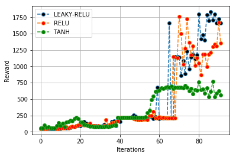
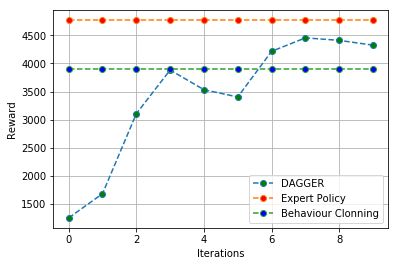
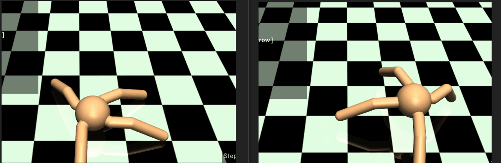

# Imitation Learning(Behaviour Cloning and DAGGER)

**Dependencies**:
-TensorFlow   
-MuJoCo version 1.31 /1.51  
-OpenAI Gym  
-Microsoft Visual C++ ??


**Note**: MuJoCo versions until 1.5 do not support NVMe disks therefore won't be compatible with recent Mac machines.
There is a request for OpenAI to support it that can be followed [here](https://github.com/openai/gym/issues/638).

The only file that you need to look at is `run_expert.py`,`dagger.py` which is code to load up an expert policy, run a specified number of roll-outs, and save out data.

In `experts/`, the provided expert policies are:
* Ant-v1.pkl
* HalfCheetah-v1.pkl
* Hopper-v1.pkl
* Humanoid-v1.pkl
* Reacher-v1.pkl
* Walker2d-v1.pkl

**Example Usage**
```Python
%run run_expert.py experts/Hopper-v1.pkl Hopper-v2 --render --num_rollouts 10
```

The name of the pickle file corresponds to the name of the gym environment.


**[Detailed Instructions](http://rail.eecs.berkeley.edu/deeprlcourse-fa17/f17docs/hw1fall2017.pdf)**

## Experiment 1. Convergence of Behaviour Cloning using a four layered neural net Agent trying to imitating the expert's policy ##

The expert that we are trying to imitate here is the Hopper-v2.


Plot showing the training loss as a function of the number of epochs is shown below.


## Experiment 2. Peformance of DAGGER on different Hyperparameter Settings for the Hopper Environment ##

**DAGGER**: DAGGER proceeds by collecting a dataset
at each iteration under the current policy and trains the next
policy under the aggregate of all collected datasets. The intuition
behind this algorithm is that over the iterations, we
are building up the set of inputs that the learned policy is
likely to encounter during its execution based on previous
experience (training iterations).



Here RELU activations seems to give significantly better performance than tanh, with LEAKY-RELU(0.01 negative slope) giving the best performance in terms of returns. Other hyperparameters were kept unchanged(Batch Size:5000, Neural Architecture:3 hidden layers[120,100,80], Num-Initial-Rollouts:15, Optimizer: Adam Optimizer).

**IMPORTANT NOTE**: The plot shown above uses a fresh initialization of the model weights in each iteration. However in the next experiment we will be using the pre-trained weights from the previous iterations. The later produces significantly better performance.

## Experiment 3. Peformance comparison DAGGER vs Behaviour Clonning ##

Number of Data Points Behaviour Clonning: 44687
Number of Data Points DAGGER: 49500

The performance comparison is shown in the plot below:



Figure Below shows the learnt behaviour of the Ant, at he starting of DAGGER(left) and in the final stages of learning(right)


