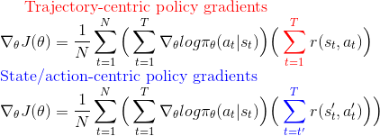
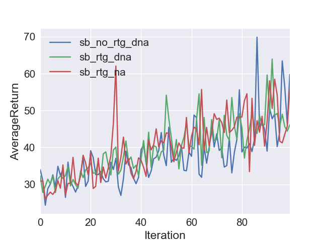
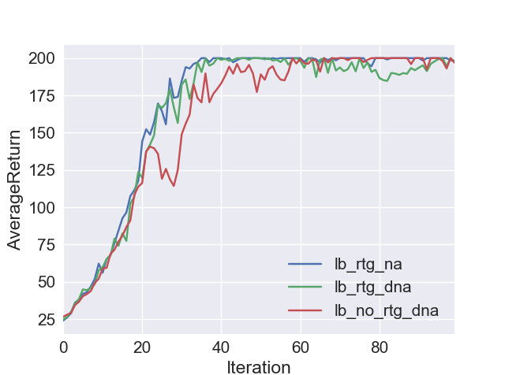
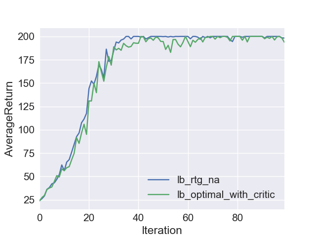
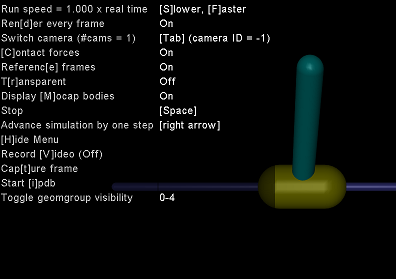
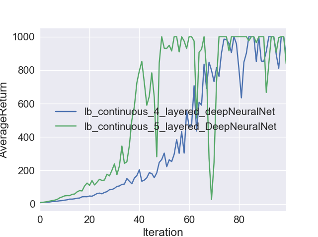
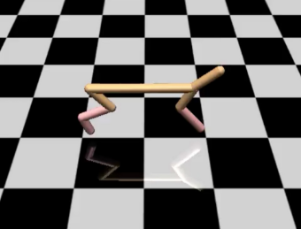
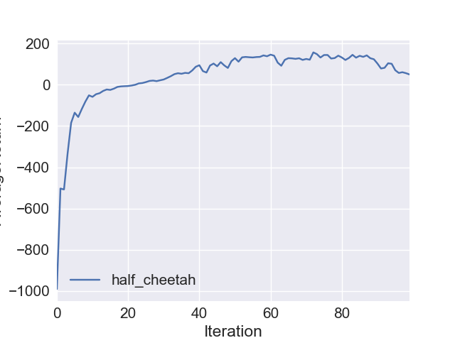
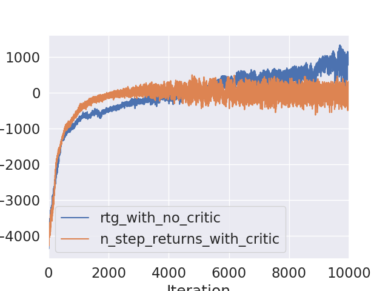
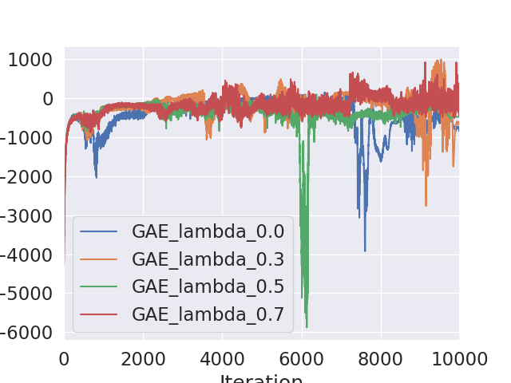

Deep Reinforcement Learning Based Control in Continuous Action and State Spaces using Policy Gradients and Actor-Critic Networks
================================
 

## How To Use


**Dependencies**

-TensorFlow   
-MuJoCo version 1.31 /1.51  
-OpenAI Gym  
-OpenCV
-Microsoft Visual C++ 

 **Usage**

```
python train_pg.py InvertedPendulum-v2 --render -n 100 -b 5000 -e 5 -rtg --exp_name lb_continuous_5_layered_DeepNeuralNet -l 3 -lr 1e-2
```

**[Detailed Instructions](http://rail.eecs.berkeley.edu/deeprlcourse-fa17/f17docs/hw2_final.pdf)**


## Experiment 1: Cart Pole with Discrete Action 

The [cart-pole model](http://www.derongliu.org/adp/adp-cdrom/Barto1983.pdf) has four state variables
> The 4 numbers in the box space for observation represents: [position of cart, velocity of cart, angle of pole, rotation rate of pole]


**Observation 1**: Comparing Fig 1 and Fig 2, it is clear that having a larger
    batch size helps in faster learning and better policies in terms of Average
    Returns.

**Observation 2**: From Fig 3 it is clear that state/action centric policy(green) gives much better policies. than a trajectory centric policy(red).


Equation [2](https://docs.google.com/document/d/1Iw_TUijQ-C6F0M3mWWco8_rDiuEblKvtr8mCB3ITLas/edit#bookmark=id.ykbyvnen9iwg)

Also Advantage normalization gives slightly better policies.

**Observation 3**: However having a baseline didn’t improve the policy as expected as shown in figure 3.



Figure 1


Figure 2



Figure 3



Figure 4

 
## Experiment 2: Inverted Pendulum with Continuous Actions

 Command Line Code
```
python train_pg.py InvertedPendulum-v2 --render -n 100 -b 5000 -e 5 -rtg --exp_name lb_continuous_5_layered_DeepNeuralNet -l 3 -lr 1e-2
```




 

Figure 5

 **Observation 1:** The learning curves with two different network architectures
    is shown in Fig 6. Its clear from the graph that the 5 layered feed forward
    neural network learned better policies in lesser number of iterations.




Figure 6

 

## Experiment 3: HALF CHEETAH

Code Block

```
python train_pg.py HalfCheetah-v2 -ep 150 --discount 0.9 -b 40000 -rtg -l 3 -s 32 -lr 4e-2 --exp_name half_cheetah
```

[Half-Cheetah](http://prac.elka.pw.edu.pl//~pwawrzyn/pub-s/0601_SLEAC.pdf), is a planar kinematic string of 9 links and 10 joints; the
“paws” of Half-Cheetah will also be called joints. The angles of 4-th and 5-th
joint are fixed, all the the others are controllable. Consequently, Half-Cheetah
is a 6-degree-of-freedom walking robot.



Figure 7



Figure 8


**Observation 1:** After a lot of hyper parameter tuning, the settings that gave
an average return above 150 before 100 iterations is given in the code block
below. It used an unusually high batch size and a 5 layered deep neural network
without a critic.

**Observation 2:** We also tested the variance reduction techniques with n-step returns and with critic.
Here is the plot of average returns over no of iterations


 
Figure 9

**Observation 3** GAE(Generalized Advantage Return) is a weighted combinations of n-step returns.
It introduces a new parameter lambda, which controls the tradeoff between bias and variance. 
With lambda=0, the estimator becomes a simple actor-critic model with less variance but with bias.
With lambda=1, advantage estimator becomes the empirical sum of returns with average baseline. It has more variance because
of sum of terms but with less bias. Here the plot shows the average return for different values of lambda.



Figure 10

Here we can see that when lamba = 0.7, variance is minimum.

All the experiments with n-step returns and GAE used the same actor model(2 layers with 20, 10 units successively)
and same critic model(3 layers with 20, 15 and 10 units).


## REFERENCES

 

1. Paweł Wawrzynski, [Learning to Control a 6-Degree-of-Freedom Walking Robot](http://prac.elka.pw.edu.pl//~pwawrzyn/pub-s/0601_SLEAC.pdf) 

2. A. G. Barto, R. S. Sutton, and C. W. Anderson, [“Neuronlike adaptive elements
that can solve difficult learning control problems”](
http://www.derongliu.org/adp/adp-cdrom/Barto1983.pdf)

3. John Schulman, Philipp Moritz, Sergey Levine, Michael I. Jordan and Pieter Abbee [HIGH DIMENSIONAL CONTINUOUS CONTROL USING GENERALIZED ADVANTAGE ESTIMATION](https://arxiv.org/pdf/1506.02438.pdf)

3. CS 294: Deep Reinforcement Learning, Fall 2017

 

 
