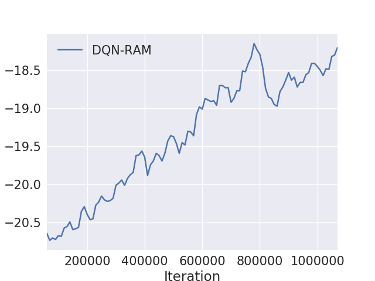
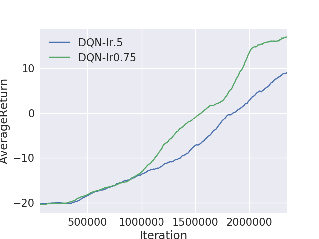
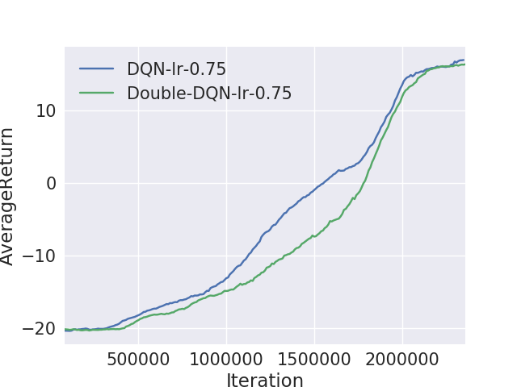

Reinforcement Learning Based Control using High Dimensional Sensory Inputs - Deep Q Learning and Deep Double Q Learning
============================================================================================


 
## How To Use


**Dependencies**

-TensorFlow   
-atari-py  
-OpenAI Gym  
-OpenCV
-Microsoft Visual C++ 

 **Usage**

```
python train_pg.py InvertedPendulum-v2 --render -n 100 -b 5000 -e 5 -rtg --exp_name lb_continuous_5_layered_DeepNeuralNet -l 3 -lr 1e-2
```

**Detailed Instructions**
 
## Experiment 1: Find Control Policies for playing Atari-2600 Pong directly from Pixels 

The game of Pong is an excellent example of a simple RL task. In the ATARI 2600 version we’ll use you play as one of the paddles (the other is controlled by a decent AI) and you have to bounce the ball past the other player.On the low level the game works as follows: we receive an image frame (a 210x160x3 byte array (integers from 0 to 255 giving pixel values)) and we get to decide if we want to move the paddle UP or DOWN (i.e. a binary choice). After every single choice the game simulator executes the action and gives us a reward: Either a +1 reward if the ball went past the opponent, a -1 reward if we missed the ball, or 0 otherwise. And of course, our goal is to move the paddle so that we get lots of reward.


**Pre-procesing**

As given in the DeepMind [Playing Atari with Deep Reinforcement Learning](https://www.cs.toronto.edu/~vmnih/docs/dqn.pdf) paper:
>Working directly with raw Atari frames, which are 210 × 160 pixel images with a 128 color palette,
can be computationally demanding, so we apply a basic preprocessing step aimed at reducing the
input dimensionality. The raw frames are preprocessed by first converting their RGB representation
to gray-scale and down-sampling it to a 110×84 image. The final input representation is obtained by
cropping an 84 × 84 region of the image that roughly captures the playing area.

**Network Architecture**


**Observation 1 - Convergence**

The implementation of the DQN with Piecewise linear schedule learning rate and exploration(epsilon greedy) converged as expected as shown in figure 2, indicating that our implementation is correct. The experiments were run on the lightweight version(states emulator RAM instead of images) initially.The experiment was run for 1 million time steps. 


Figure 2

**Observation 2 - Hyperparameters**

As shown in figure 3, a learning rate multiplier of 0.75 gave much better learning performance(in terms of convergence rate) than higher learning rates of 0.5. For the default rate of 1, the system actually diverged in this implementation.  
 Also using a Huber Loss rather than the mean-squared loss also made a huge difference, though learning curve is not plotted for the same.


Figure 3

## Experiment 2: Improving Performance using Double Q Learning
 
The popular Deep Q-learning algorithm is known to overestimate
action values under certain conditions.This makes it more likely to select overestimated
values, resulting in overoptimistic value estimates. 

To prevent
this, double DQN can decouple the selection from the evaluation.In double DQN use the current network(not the target network) to select actions in the Q Learning Bellman Equation, and use the target network to select the action values.  


Equation [1](https://docs.google.com/document/d/1Iw_TUijQ-C6F0M3mWWco8_rDiuEblKvtr8mCB3ITLas/edit#bookmark=id.o1wk0u1ffpzv)

As shown in figure below, for the same learning rate, the Double DQN seems to be picking up with the DQN Learning in the final stages of learning and can possible outperform with more training steps(currently not performed) as shown in the [paper](file:///C:/Users/DELL/Downloads/12389-55999-1-PB.pdf). 





Figure 4: Graph from our experiments(above) and [paper](file:///C:/Users/DELL/Downloads/12389-55999-1-PB.pdf)(below).

## REFERENCES

 

1. Volodymyr Mnih et all [Playing Atari with Deep Reinforcement Learning](https://www.cs.toronto.edu/~vmnih/docs/dqn.pdf) 

2. Volodymyr Mnih et all [“Human-level control through deep reinforcement
learning”](
https://storage.googleapis.com/deepmind-data/assets/papers/DeepMindNature14236Paper.pdf)

3. Adrien Lucas Ecoffet's [Blog](https://becominghuman.ai/lets-build-an-atari-ai-part-1-dqn-df57e8ff3b26)

4. Andrej Karpathy's [Blog](http://karpathy.github.io/2016/05/31/rl/)

5. Van Hasselt, Guez, Silver. [Deep reinforcement learning with double Q-learning: a
very effective trick to improve performance of deep Q-learning.](file:///C:/Users/DELL/Downloads/12389-55999-1-PB.pdf)

 

 

 

 

 

 

 

 

 

 

 

 

 

 

 

 

 

 

 

 

 

 

 

 

 

 

 

 

 

 

 

 

 

 

 

 

 

 

 

 

 

### References

1.  Mnih, Volodymyr, et al. "Human-level control through deep reinforcement
    learning." *Nature* 518.7540 (2015): 529.

2.  CS 294: Deep Reinforcement Learning - Fall 2017 UCB

 

 

 

 
