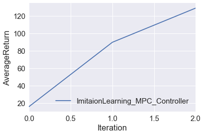
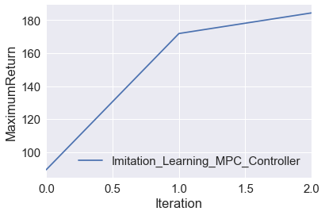

Model Based RL - Imitating Optimal Controllers
================================

## How To Use


**Dependencies**

-TensorFlow   
-MuJoCo version 1.31 /1.51  
-OpenAI Gym  
-Microsoft Visual C++ 

 **Usage**

```
python main.py -n 1 -ep 1000 -m 10 -sp 500 -r 150 -d 2 -b 1000 -m 10
```

**[Detailed Instructions](http://rail.eecs.berkeley.edu/deeprlcourse-fa17/f17docs/hw4.pdf)**

The Model Based RL Framework used in the experiments is shown in the figure below:


## Experiment 1: Fit a dynamics model to random data alone and use the learned dynamics model in a MPC controller to control the cheetah robot 

An average return of 134 was obtained. Detailed result is shown below:
 
 

Settings Used:
```
python main.py -n 1 -ep 1000 -m 10 -sp 500 -r 150 -d 2 -b 1000 -m 10
```


## Experiment 2: Fit a dynamics model with Data Aggregation and use the learned dynamics model in a MPC controller to control the cheetah robot (3 iterations)

The experiment was run over 3 Dagger iterations because of time constraints with the setting as shown below:

```
python main.py -n 3 -ep 300 -m 10 -sp 500 -r 50 -d 10 -b 2000
```
The rewards Vs Dagger Iteration curve is shown below:






Better results can be obtained with the settings below**(slower)**:

```
python main.py -n 10 -ep 1000 -m 10 -sp 1000 -r 50 -d 10 -b 2000
```

## REFERENCES

1. Nagabandi et all, 2017 ["Neural Network Dynamics
for Model-Based Deep Reinforcement Learning
with Model-Free Fine-Tuning"](https://arxiv.org/pdf/1708.02596.pdf)
2. CS 294: Deep Reinforcement Learning, Fall 2017