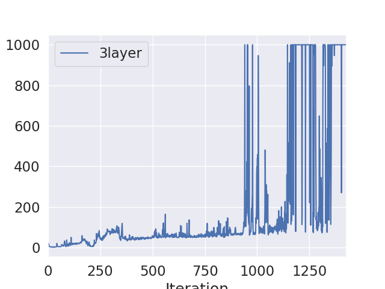

# Deep Deterministic Policy Gradients

**Dependencies**:
-TensorFlow   
-MuJoCo version 1.31 /1.51  
-OpenAI Gym  


**Note**: MuJoCo versions until 1.5 do not support NVMe disks therefore won't be compatible with recent Mac machines.
There is a request for OpenAI to support it that can be followed [here](https://github.com/openai/gym/issues/638).

The only file that you need to look at are `DDPG.py`. It contains the code to learn the policy, save the model and reload it back.

**Example Usage**
```python3.5 DDPG.py --env env_name --test True/False
```
By default, Test flag is False, which allows us to learn the policy.
Once the policy is learned and saved to the disk, activate the test flag to load the model and render the environment.


**[Detailed Instructions](http://rail.eecs.berkeley.edu/deeprlcourse-fa17/f17docs/hw1fall2017.pdf)**

## Experiment 1. InvertedPendulum Environment (InvertedPendulum-v2)

The pendulum on the cart starts upright, and the goal is to prevent it from falling over. The system is controlled by applying a force of +1 or -1 to the cart. A reward of +1 is provided for every timestep that the pole remains upright. The episode ends when the pole is more than 15 degrees from vertical. Here is the rendering of a Random agent on the environment.


Plot showing the reward as a function of the number of training iterations is shown below.



Rendering after the policy is learnt. Actor is a 3-layer network. At the end of training we are able to achieve a reward of 1000


## Experiment 2. Pendulum environment (Pendulum-v0)

In this version of the problem, the pendulum starts in a random position, and the goal is to swing it up so it stays upright.
Random agemt on the environment.


The same 3 layer netowork is used as actor. And the average reward we reached here is around -200. Changing the network and learning the policy might improve the reward.


Here is the rendering after learning the policy.


## References

1. Patrick Emami, [Deep Deterministic Policy Gradients in TensorFlow](https://pemami4911.github.io/blog/2016/08/21/ddpg-rl.html)

3. CS 294: Deep Reinforcement Learning, Fall 2017

