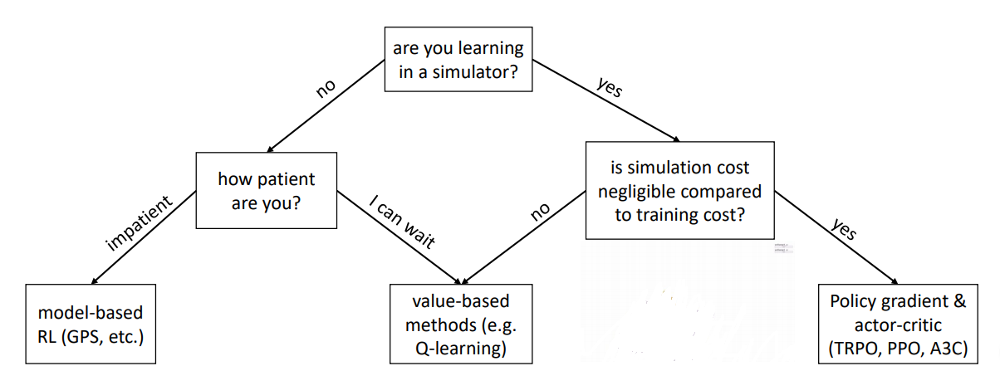

# DeepReinforcementLearning
Contains codes and reports of running Deep RL techniques on standard simulated environments like openAI Gym, Mujoco etc. The repository will be updated from time to time.

## Table of Contents

1. [Imitation Learning - DAGGER](https://github.com/vaisakh-shaj/DeepReinforcementLearning/tree/master/1_BehaviourCloning_DAGGER)
2. [Policy Gradient - Actor Critic Networks](https://github.com/vaisakh-shaj/DeepReinforcementLearning/tree/master/2_Actor_Critic_and_Policy_Gradient)
3. [Deep Q Learning and Double Deep Q Learning](https://github.com/vaisakh-shaj/DeepReinforcementLearning/tree/master/3_Deep_Double_Q_Learning_Atari_Games)

## Which RL algorithm to use ?

## Coming Soon

- Transfer and Life Long Learning - an RL Perspective
- Gradient Free Deep RL